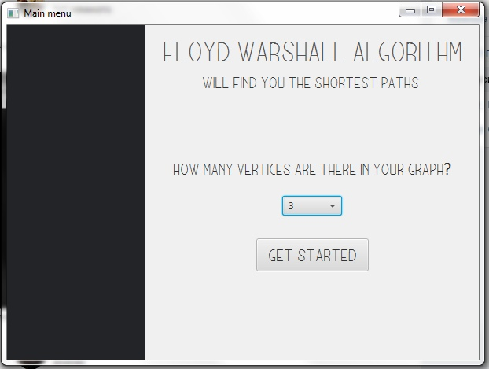
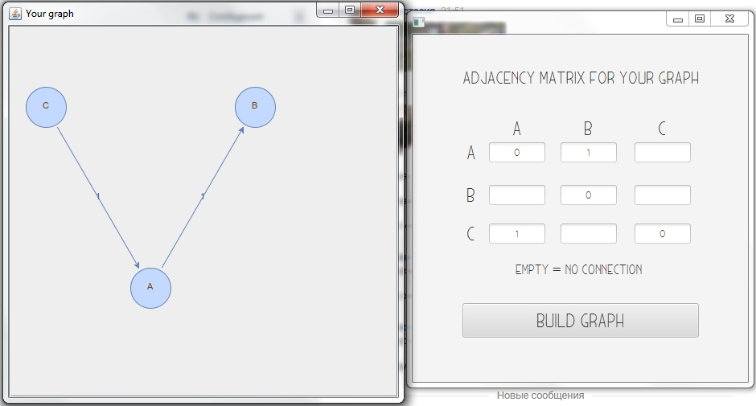
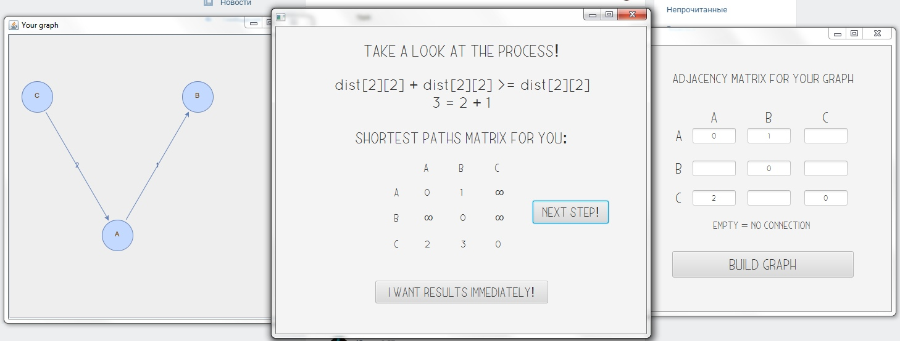

# Floyd-Warshall algorithm

  

### Description
User-friendly GUI application for visualisation of Floyd-Warshall algorithm for finding shortest paths in a weighted graph.

### Features
* Simple
* Fast
* Intuitive
* Elegant

### Algorithm explanation

Amazingly simple explanation of the algorithm on [youtube](https://www.youtube.com/watch?v=4OQeCuLYj-4&feature=youtu.be).

### User interface
> Step 1: Choose the number of vertices in your graph

> Step 2: Fill the adjacency matrix for your graph. Bear in mind: algorithm will not work with graphs with negative cycles but the application will not crash if you input such graph.

> Step 3: Take a look at your graph. Quite pretty, isn't it? Though, you may still drag vertices if something is overlapped.

> Step 4: Start algorithm process

### Development progress

- [x] Design GUI
- [x] Create prototype for displaying graph
- [ ] Visualise algorithm
    - [ ] Steps forward
    - [ ] Steps backwards
    - [ ] Animation
- [ ] Make it work on Linux
- [ ] Tests

### Developers
* Mashina Yulia - GUI
* Krevchik Angelina - Algorithm & Testing
* Protsvetkina Anastasia - Algoritm & Documentation
